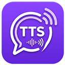

# Dokumentacja Techniczna i Podręcznik Użytkownika: Twitch TTS


[](https://opensource.org/licenses/MIT)

**Data aktualizacji:** 15 sierpnia 2026 r.  
**Wersja aplikacji:** 1.0.1 
**Autor:** Piotr „utak3r” Borys  
**Licencja:** MIT  



---

## 1. Wprowadzenie i Cel Projektu

**Twitch TTS** to nowoczesna, wysoce zoptymalizowana aplikacja desktopowa dla systemu Windows (10/11), przeznaczona dla streamerów platformy Twitch. Umożliwia ona automatyczną, lokalną syntezę mowy (Text-to-Speech) w czasie rzeczywistym dla wiadomości z czatu oraz nagród za punkty kanału (Channel Points).

Aplikacja została w całości napisana w języku **Rust** z wykorzystaniem deklaratywnego frameworka graficznego **Slint** oraz lokalnego silnika neuronowej syntezy mowy **Piper TTS**.

### Główne zalety i właściwości:
* **Zero chmury i pełna prywatność:** Synteza mowy odbywa się w 100% lokalnie na maszynie streamera, bez konieczności opłacania zewnętrznych API (np. Amazon Polly, Google Cloud TTS) czy przesyłania danych na zewnętrzne serwery.
* **Minimalne opóźnienia:** Bezpośrednie dekodowanie i generowanie próbek PCM 16-bit / f32 w pamięci procesu.
* **Nowoczesny interfejs GUI (Dark Theme):** Lekki, estetyczny interfejs stworzony w technologii Slint, zużywający minimalne zasoby procesora i pamięci RAM.
* **Wsparcie dla wirtualnych kart dźwiękowych:** Płynna współpraca z oprogramowaniem transmisyjnym (OBS Studio, Streamlabs Desktop) poprzez wyjścia audio takie jak VB-Audio Cable czy Voicemeeter.
* **Globalne skróty klawiszowe (Global Hotkeys):** Możliwość natychmiastowego wyciszenia (Mute) lub pominięcia (Skip) wiadomości za pomocą klawiszy funkcyjnych (np. F9/F10) w trakcie trwania rozgrywki w trybie pełnoekranowym.
* **Natywna dystrybucja Windows:** Aplikacja działa bez otwierania zbędnego okna konsoli (`#![windows_subsystem = "windows"]`), posiada zaszytą ikonę oraz przygotowany instalator MSI (WiX Toolset).

---

## 2. Architektura Systemu i Zrealizowane Rozwiązania

Aplikacja oparta jest na architekturze sterowanej zdarzeniami (Event-Driven Architecture), łączącej asynchroniczny runtime **Tokio** z pętlą zdarzeń UI **Slint**.

```text
┌───────────────────────────────────────────────────────────────────────────────────┐
│                               Slint UI Layer (GUI)                                │
│   [ 📊 Live View ] [ 🧪 Test Lab ] [ 🛡️ Filters ] [ 🔊 Audio ] [ 🎮 Twitch ] [ ⚙️ ]  │
└────────────────────────────────────────┬──────────────────────────────────────────┘
                                         │ Slint ModelRc / Slint Callbacks
                                         │ Tokio Channels (mpsc / watch)
┌────────────────────────────────────────▼──────────────────────────────────────────┐
│                                Rust Core Backend                                  │
│                                                                                   │
│  ┌────────────────────────┐                   ┌────────────────────────────────┐  │
│  │ Twitch EventSub WS     │                   │ Global Hotkeys Manager         │  │
│  │ (tokio-tungstenite)    │                   │ (Windows Low-Level Hook)       │  │
│  └───────────┬────────────┘                   └───────────────┬────────────────┘  │
│              │ (Wiadomość z czatu)                            │                   │
│              ▼                                                │                   │
│     [ TextFilter Engine ]                                     │                   │
│     • Usuwanie URL                                            │                   │
│     • Aliasy fonetyczne (nick & treść)                        │                   │
│     • Redukcja spamu znaków i słów                            │                   │
│     • Cenzura wulgaryzmów (profanity_words.txt)               │                   │
│     • Obcinanie długości do max_characters                    │                   │
│     • Szablon zapowiedzi nicku                                │                   │
│              │                                                │                   │
│              ▼ (SpokenItem)                                   │                   │
│      [ OverflowQueue ] <────── Ochrona przed zalaniem         │                   │
│              │                 (Polityka Drop Oldest)         │                   │
│              ▼                                                │                   │
│    [ Piper TTS Task ]                                         │                   │
│    (piper.exe / stdin pipe / PCM raw output)                  │                   │
│              │                                                │                   │
│              ▼ (Vec<f32> PCM Samples)                         │                   │
│   [ Audio Playback Engine ] <─────────────────────────────────┘                   │
│   • Rodio Sink + CPAL Output Device                                               │
│   • Bufor ciszy (Padding)                                                         │
│   • Kontrola Play/Pause/Mute/Skip/Volume                                          │
│              │                                                                    │
│              ▼                                                                    │
│     Głośniki / Słuchawki / VB-Audio Virtual Cable                                 │
└───────────────────────────────────────────────────────────────────────────────────┘
```

### 2.1. Kluczowe komponenty backendu

1. **Klient Twitch EventSub WebSocket (`src/twitch/eventsub.rs`):**
   * Nawiązuje bezpieczne połączenie WebSocket z `wss://eventsub.wss.twitch.tv/ws`.
   * Rejestruje subskrypcje zdarzeń:
     * `channel.chat.message` (wiadomości z czatu w czasie rzeczywistym),
     * `channel.channel_points_custom_reward_redemption.add` (nagrody za punkty kanału).
   * Obsługuje zdarzenia `session_reconnect` (bezstratne przełączanie sesji WebSocket) oraz mechanizmy Keepalive/Ping.
   * Filtruje zduplikowane komunikaty po identyfikatorze `message_id`.

2. **Automatyczna autoryzacja 1-Click OAuth (`src/twitch/auth.rs`):**
   * Uruchamia lokalny serwer HTTP na porcie `17563` (`http://localhost:17563/callback`).
   * Automatycznie otwiera domyślną przeglądarkę systemową z adresem autoryzacji Twitch.
   * Osadzony skrypt JavaScript w stronie callbacku przechwytuje token z fragmentu adresu (`#access_token=...`) i przekazuje go do wewnętrznego endpointu `/token?access_token=...`.
   * Dokonuje natychmiastowej weryfikacji tokenu z API Twitcha (`https://id.twitch.tv/oauth2/validate`), pobierając nazwę użytkownika oraz `broadcaster_user_id`.
   * Statyczny identyfikator klienta (`CLIENT_ID`) jest wkompilowany w aplikację z pliku `.client_id`.

3. **Pipeline Przetwarzania Tekstu (`src/filter/mod.rs`):**
   * **Ignorowanie botów:** Natychmiastowe odrzucenie wiadomości od użytkowników zdefiniowanych na liście `ignore_users` (np. Nightbot, StreamElements).
   * **Czyszczenie adresów URL:** Wykrywanie i usuwanie odnośników `http://`, `https://`, `www.` przed przekazaniem do syntezy.
   * **Aliasy fonetyczne:** Zamiana trudnych do wymówienia nicków i słów (np. `utak3r` $\rightarrow$ `utaker`, `Dr3gu` $\rightarrow$ `Dregu`) zarówno w nazwie nadawcy, jak i w treści wypowiedzi.
   * **Ochrona anty-spamowa:** Redukcja wielokrotnie powtórzonych liter (np. `koooorwa` $\rightarrow$ `koorwa`) oraz powtarzających się ciągów słów.
   * **Cenzura wulgaryzmów:** Porównanie ze słownikiem `profanity_words.txt` i zamiana niedozwolonych słów na łagodny dźwiękowy zamiennik fonetyczny (`"piiiiiip"`).
   * **Limit znaków:** Skracanie zbyt długich wiadomości z dodaniem wielokropka `...`.
   * **Zapowiedź nadawcy:** Opcjonalne dodanie formatki, np. `"{nick} mówi: {message}"`.

4. **Kolejka Bezpieczeństwa (`src/domain/queue.rs`):**
   * Implementuje bufor FIFO o konfigurowalnej maksymalnej pojemności (`max_queue_size`, domyślnie 5).
   * Zastosowanie strategii **Drop Oldest** chroni stream przed zjawiskiem narastającej kolejki i wielominutowego opóźnienia podczas tzw. raidu lub wzmożonej aktywności na czacie.
   * Usunięte elementy są raportowane w UI ze statusem `Dropped [Overflow]`.

5. **Silnik Syntezy Piper TTS (`src/tts/piper.rs`):**
   * Wywołuje zoptymalizowany, przenośny proces `piper.exe` w tle, ukrywając okno konsoli za pomocą flagi `CREATE_NO_WINDOW` (0x08000000).
   * Przesyła tekst strumieniowo na standardowe wejście (`stdin`) i odczytuje surowy strumień bajtów 16-bit PCM z wyjścia (`stdout`).
   * Konwertuje surowe próbki całkowitoliczbowe na znormalizowane wartości zmiennoprzecinkowe `f32` w przedziale `[-1.0, 1.0]`.
   * Posiada wbudowany mechanizm wyszukiwania plików binarnych Pipera w katalogach:
     1. Lokalny katalog aplikacji: `piper/piper.exe` oraz `piper/espeak-ng-data`,
     2. Katalogi instalacyjne systemu Windows (`C:\Program Files\Piper\...`),
     3. Zmienna środowiskowa `PATH`.
   * W przypadku braku modelu lub pliku binarnego aplikacja płynnie przełącza się na generator testowy (`MockTTSEngine` - ton 440 Hz), informując o tym w logach.

6. **Moduł Odtwarzania Audio (`src/audio/player.rs`, `src/audio/devices.rs`):**
   * Wykorzystuje biblioteki `rodio` oraz `cpal`.
   * **Dopełnienie ciszą (Padding):** Dodaje na końcu wygenerowanego bufora konfigurowalną liczbę próbek ciszy (`0.0f32`), co zapobiega nagłemu ucinaniu ostatnich głosek przez bufory wirtualnych kart dźwiękowych (np. VB-Cable).
   * **Zarządzanie urządzeniami:** Umożliwia dynamiczne pobieranie listy urządzeń wyjściowych WASAPI/DirectSound i wybór konkretnej karty dźwiękowej.
   * **Obsługa Skip & Mute:**
     * *Skip:* Natychmiastowe zatrzymanie aktualnego `Sink` i pobranie następnej frazy z kolejki.
     * *Mute:* Blokada pobierania kolejnych próbek z jednoczesnym wyciszeniem strumienia.

7. **Zarządzanie Skrótami Klawiszowymi (`src/hotkeys/manager.rs`):**
   * Rejestruje globalne skróty klawiszowe w systemie Windows przy użyciu biblioteki `global-hotkey`.
   * Pozwala na wyciszanie/odciszanie oraz pomijanie wiadomości bez konieczności przełączania okien (działa podczas gry w pełnym oknie).

---

## 3. Podręcznik Użytkownika (Krok po Kroku)

### 3.1. Pierwsze Uruchomienie i Konfiguracja Twitcha

1. Uruchom aplikację `twitch-tts.exe`.
2. Z lewego menu bocznego wybierz zakładkę **🎮 Twitch Account**.
3. Kliknij przycisk **Connect with Twitch (1-Click OAuth)**.
4. Zostanie otwarta przeglądarka internetowa. Zaloguj się na swoje konto Twitch i kliknij **Autoryzuj** (Authorize).
5. Po udanej autoryzacji w oknie przeglądarki pojawi się zielony komunikat *„Authorization successful!”*. Możesz zamknąć kartę.
6. Aplikacja automatycznie odczyta Twój identyfikator użytkownika oraz login i nawiąże połączenie z czatem.
7. **Wybór trybu nasłuchiwania:**
   * **Read All Chat Messages:** Syntezuje wszystkie wiadomości pojawiające się na czacie (z pominięciem zdefiniowanych botów).
   * **Read Channel Points Reward Only:** Czyta tylko wiadomości przesłane w ramach nagrody za punkty kanału. Wpisz wówczas identyfikator nagrody w polu `Reward ID`.

---

### 3.2. Konfiguracja Głosu i Dźwięku (Audio & Voice)

1. Przejdź do zakładki **🔊 Audio & Voice**.
2. **Model Piper:**
   * Kliknij przycisk **Browse** przy polu *Model Path (.onnx)* i wskaż plik modelu (domyślnie w folderze `models/`, np. `pl_zenski_1.onnx`).
   * Kliknij **Browse** przy polu *Config Path (.json)* i wskaż odpowiadający mu plik konfiguracyjny (np. `pl_zenski_1.onnx.json`).
3. **Parametry syntezy:**
   * **Speaker ID:** Wybierz identyfikator mówcy (dla modeli jednoosobowych pozostaw `0`).
   * **Speech Rate (Speed):** Ustaw tempo mówienia suwakiem (standardowo `1.0x`, zakres 0.5x – 2.0x).
   * **Audio Output Device:** Wybierz urządzenie wyjściowe. Jeśli przesyłasz dźwięk do OBS Studio, wybierz wirtualną kartę (np. *CABLE Input (VB-Audio Virtual Cable)*). Kliknij **Refresh Devices**, jeśli urządzenie zostało podłączone po uruchomieniu aplikacji.
   * **Padding (End Silence):** Ustaw bufor ciszy (rekomendowana wartość: `0.3s`), aby uniknąć ucinania końcówek słów.

---

### 3.3. Zarządzanie Filtrami i Moderacją

Przejdź do zakładki **🛡️ Filters & Moderation**:

* **Przełączniki główne:**
  * `Enable Profanity Filter` – włącza cenzurę niepożądanych słów.
  * `Filter Twitch Emotes` – usuwa emotki z treści wiadomości, czytając jedynie słowa.
  * `Announce Username` – poprzedza wiadomość nickiem nadawcy zgodnie z szablonem (np. `{nick} mówi: {message}`).
* **Ochrona anty-spamowa:**
  * `Max Message Characters` – maksymalna liczba znaków w pojedynczej wiadomości (np. 150).
  * `Max Repeated Characters` – redukuje sztucznie przedłużane słowa (np. limit `3` zamienia `siemaaaa` na `siemaaa`).
* **Słownik aliasów fonetycznych (Username & Word Aliases):**
  * Pozwala nauczyć silnik poprawnej wymowy skomplikowanych nicków.
  * Wpisz nick źródłowy (np. `utak3r`) i jego wersję fonetyczną (np. `utaker`), a następnie kliknij **Add Alias**.
* **Czarna lista botów (Ignored Users):**
  * Dodaj nazwy kont botów (np. `Nightbot`, `StreamElements`, `Moobot`), aby ich komunikaty nie były czytane przez TTS.
* **Słownik wulgaryzmów:**
  * Możesz edytować słowa cenzurowane bezpośrednio w pliku `profanity_words.txt`.

---

### 3.4. Monitorowanie Transmisji na Żywo (Live View)

Widok **📊 Live View** to główne centrum dowodzenia podczas trwającego streamu:

* **Wskaźnik statusu:** Informuje o stanie połączenia (`● CONNECTED (#twój_kanał)`, `● RECONNECTING`, `● OFFLINE`).
* **Pasek kontrolny:**
  * **MUTE TTS:** Natychmiast wycisza syntezator mowy.
  * **SKIP CURRENT:** Przerywa aktualnie czytaną wiadomość i przechodzi do kolejnej w kolejce.
  * **Clear Queue (N):** Opróżnia bufor oczekujących wypowiedzi.
  * **Volume:** Płynna regulacja głośności z wizualnym wskaźnikiem aktywności audio (VU Meter).
* **Tabela Aktywności (Activity Table):**
  * Pokazuje historię wszystkich otrzymanych wiadomości wraz z czasem, nickiem, tekstem i statusem (`Spoken`, `Playing`, `Filtered [Profanity]`, `Ignored [Bot]`, `Dropped [Overflow]`, `Skipped`).
  * **Szybkie akcje w wierszu:**
    * 🔁 **Replay** – ponowne odtworzenie wybranej wiadomości.
    * ➕ **Add Alias** – błyskawiczne dodanie nicku nadawcy do słownika aliasów.
    * 🚫 **Ignore User** – natychmiastowe zablokowanie użytkownika/bota.
* **Quick Test:** Pole na dole ekranu pozwala wpisać dowolną frazę i przetestować syntezę bez konieczności pisania na czacie Twitcha.

---

### 3.5. Laboratorium Mowy (Test Lab)

Zakładka **🧪 Test Lab** umożliwia precyzyjne testowanie i strojenie transformacji tekstu:

1. Wpisz testowy tekst w wieloliniowym polu edycji.
2. Zobacz podgląd potoku na żywo:
   $$\text{Oryginalny tekst} \longrightarrow \text{Po aliasach} \longrightarrow \text{Po cenzurze wulgaryzmów} \longrightarrow \text{Finalny tekst do Pipera}$$
3. Użyj przycisku **Synthesize & Play**, aby odsłuchać próbkę.
4. Użyj przycisku **Export to WAV**, aby zapisać wygenerowaną próbkę audio w postaci pliku `.wav` na dysku.

---

### 3.6. Konfiguracja Skrótów Klawiszowych (Hotkeys)
> Sekcja globalnych skrótów klawiszowych jest jeszcze w trakcie rozwoju.

1. Przejdź do zakładki **⚙️ Settings**.
2. Zaznacz opcję **Enable Global Hotkeys**.
3. Wybierz klawisze funkcyjne:
   * **Mute Toggle Key:** Domyślnie `F9`.
   * **Skip Current Key:** Domyślnie `F10`.
4. Od tej chwili wciśnięcie klawisza `F9` lub `F10` zadziała natychmiastowo, nawet gdy grasz w grę w trybie pełnoekranowym.

---

## 4. Struktura Pliku Konfiguracyjnego (`config.yaml`)

Wszystkie ustawienia aplikacji są automatycznie zapisywane w pliku `config.yaml` przy każdej zmianie w interfejsie graficznym.

```yaml
app:
  test_mode: false
  minimize_to_tray: false

twitch:
  oauth_token: "YOUR_TWITCH_OAUTH_TOKEN"
  broadcaster_user_id: "YOUR_CHANNEL_ID"
  read_all_chat: true          # true = cały czat, false = tylko nagroda za punkty
  reward_id: ""                 # Identyfikator nagrody (jeśli read_all_chat: false)

tts:
  model_path: "./models/pl_zenski_1.onnx"
  config_path: "./models/pl_zenski_1.onnx.json"
  speaker_id: 0
  speech_rate: 1.0              # Prędkość mówienia (1.0 = normalna)
  max_characters: 150           # Maksymalna długość wiadomości
  max_queue_size: 5             # Rozmiar bufora kolejki
  audio_device_name: "Default"  # "Default" lub nazwa karty dźwiękowej
  padding_sec: 0.3              # Dopełnienie ciszą na końcu bufora (sekundy)
  volume: 1.0                   # Głośność (0.0 do 1.5)

filters:
  announce_username: false
  username_template: "{nick} mówi: {message}"
  enable_profanity_filter: true
  profanity_words_file: "profanity_words.txt"
  filter_emotes: true
  ignore_users:
    - Nightbot
    - StreamElements
    - Moobot
  max_characters: 150
  max_repeated_chars: 3
  username_aliases:
    utak3r: utaker
    Dr3gu: Dregu
    masi4m: masiam
    stream: strim

hotkeys:
  enabled: false
  mute_toggle: "F9"
  skip_current: "F10"
```

---

## 5. Kompilacja, Budowanie i Dystrybucja

### 5.1. Wymagania systemowe i narzędziowe
* **System operacyjny:** Windows 10 / 11 (64-bit).
* **Rust Toolchain:** Wersja 1.84+ (edycja 2024).
* **WiX Toolset v3.11 / v4+:** (Opcjonalnie, do tworzenia instalatora `.msi`).

### 5.2. Kompilacja w trybie developerskim
```powershell
# Szybka kompilacja z oknem konsoli
cargo build

# Uruchomienie aplikacji
cargo run
```

### 5.3. Kompilacja w trybie produkcyjnym (Release)
```powershell
cargo build --release
```
Plik wykonywalny znajduje się w ścieżce `target\release\twitch-tts.exe`.

### 5.4. Generowanie Instalatora MSI (WiX Toolset)

Aplikacja wykorzystuje narzędzie **WiX Toolset** oraz wtyczkę `cargo-wix` do generowania instalatora `.msi`.

#### Automatyczne mapowanie zasobów w `build.rs`
Skrypt budowania [`build.rs`](build.rs) zawiera wbudowany mechanizm (`WixGenerator`), który automatycznie:
* Rekurencyjnie skanuje katalogi `piper/` (pliki binarne silnika, biblioteki, katalog `espeak-ng-data`) oraz `models/` (modele głosowe `.onnx` i pliki `.json`).
* Dynamicznie generuje fragmenty WiX XML (`wix/piper_files.wxs` oraz `wix/models_files.wxs`) z unikalnymi identyfikatorami komponentów i sumami kontrolnymi.
* Tworzy grupy komponentów `PiperFiles` i `ModelsFiles`, włączane bezpośrednio do definicji instalatora w [`wix/main.wxs`](wix/main.wxs).
* Dzięki dyrektywom `cargo:rerun-if-changed`, dodanie lub aktualizacja plików w `piper/` lub `models/` automatycznie odświeża manifesty instalatora przy budowaniu. Nie są wymagane żadne zewnętrzne skrypty pomocnicze.

#### Kroki budowania instalatora:
1. Upewnij się, że pliki silnika Piper znajdują się w katalogu `piper/`, a wybrane modele w katalogu `models/`.
2. Uruchom polecenie budowania instalatora:
   ```powershell
   cargo wix --nocapture
   ```
Gotowy instalator `.msi` zostanie wygenerowany w katalogu `target/wix/`.

---

## 6. Rozwiązywanie Problemów (FAQ & Troubleshooting)

> [!TIP]
> **Aplikacja nie czyta głosu (odtwarza pojedynczy ton testowy):**  
> Upewnij się, że w folderze aplikacji znajduje się katalog `piper` z plikiem `piper.exe` oraz folderem `espeak-ng-data`, a ścieżki do modelu `.onnx` i pliku `.json` w zakładce *Audio & Voice* są poprawne.

> [!IMPORTANT]
> **Ucinanie końcówek słów na wirtualnej karcie dźwiękowej (VB-Cable / Voicemeeter):**  
> Zwiększ parametr `Padding (End Silence)` w zakładce *Audio & Voice* z `0.3s` do `0.5s` lub `0.7s`. Daje to buforowi karty dźwiękowej czas na bezstratne opróżnienie danych.

> [!NOTE]
> **Błąd podczas logowania 1-Click OAuth:**  
> Upewnij się, że żaden inny program nie blokuje portu `17563` na adresie lokalnym `127.0.0.1`. W razie problemów wyłącz na moment restrykcyjne oprogramowanie antywirusowe/firewall dla portu lokalnego. Ten port jest konieczny dla prawidłowego zalogowania się do konta Twitch.

> [!WARNING]
> **Skróty klawiszowe nie reagują w grze:**  
> Jeśli gra uruchomiona jest z uprawnieniami administratora, aplikacja `twitch-tts.exe` również musi zostać uruchomiona z uprawnieniami administratora, aby system Windows zezwolił na przechwycenie globalnego hooka klawiatury.
